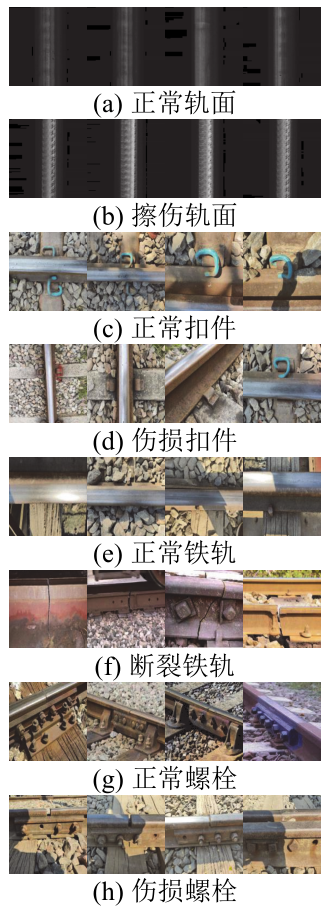

# 钢轨缺陷检测数据集

本数据集主要来源于本课题组任中伟同学搜集整理的钢轨缺陷图像数据，主要的来源包括

 - [Railway Track Fault Detection](https://www.kaggle.com/salmaneunus/railway-track-fault-detection)
 - [RSDDs dataset](http://icn.bjtu.edu.cn/Visint/resources/RSDDs.aspx)
 - Google搜索

----------

主要的缺陷类型包括：

所有图像均是224x224大小，推荐使用的神经网络模型为ResNet18，可达93%的预测精度。

如您需要原始文件，请访问[百度网盘地址](https://pan.baidu.com/s/1WY3hzjggW2Qz-p7DezdiVQ)，密码bjtu 。

----------

注1：RailwayDefectDetectionDatabase V2这个压缩包里的数据对应的是我们铁道学报论文实验，在原有V1版本数据集上进行了部分扩充，特此说明。

注2：另外，从[阿莫电子论坛](https://www.amobbs.com/thread-5749919-1-1.html)搜集到铁轨裂纹数据集，分享如下：

链接: https://pan.baidu.com/s/1rMMUj4A2wNCWwmFsJIaTiQ 提取码: 2cxe

联系人：任中伟 (18281272@bjtu.edu.cn) 方维维 (fangww@bjtu.edu.cn)

## 铁道学报论文引用

	@article{任中伟2023面向轨道缺陷检测的联邦学习轻量化模型训练技术研究,
		title={面向轨道缺陷检测的联邦学习轻量化模型训练技术研究},
		author={任中伟 and 方维维 and 许文元 and 李中睿 and 胡一寒},
		journal={铁道学报},
		volume={45},
		number={306},
		pages={77--83},
		year={2023}
	}

致谢：本数据集及相关的研究受北京市自然科学基金-丰台轨道交通前沿研究联合基金(L191019)资助。
