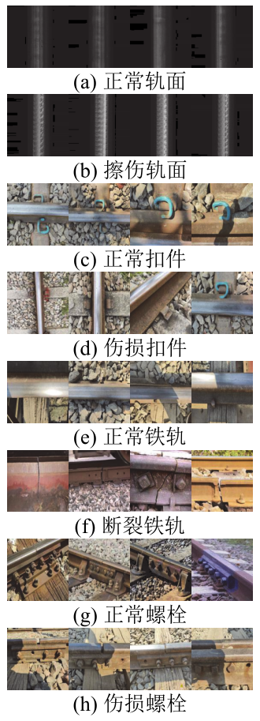

# 钢轨缺陷检测数据集

[](https://github.com/fangvv/RTFD-Dataset) — [https://github.com/fangvv/RTFD-Dataset](https://github.com/fangvv/RTFD-Dataset)

<p align="center">
  
</p>

## 📖 数据集简介

本数据集由课题组任中伟同学搜集整理，主要用于钢轨表面缺陷检测任务。所有图像统一为 **224×224** 大小，使用 **ResNet18** 模型可达 **93%** 的预测精度。

### 数据来源

| 来源 | 说明 |
|---|---|
| [Railway Track Fault Detection (Kaggle)](https://www.kaggle.com/salmaneunus/railway-track-fault-detection) | 钢轨缺陷公开数据集 |
| [RSDDs Dataset](http://icn.bjtu.edu.cn/Visint/resources/RSDDs.aspx) | 北京交通大学 RSDDs 数据集 |
| Google 搜索 | 网络搜集补充 |
| [阿莫电子论坛](https://www.amobbs.com/thread-5749919-1-1.html) | 铁轨裂纹数据集 |

### 下载方式

| 版本 | 说明 | 下载地址 |
|---|---|---|
| V1 | 原始数据集 | [百度网盘](https://pan.baidu.com/s/1WY3hzjggW2Qz-p7DezdiVQ) 密码：`bjtu` |
| V2 | 扩充版（对应铁道学报论文实验） | 同上 |
| 铁轨裂纹数据集 | 阿莫论坛搜集 | [百度网盘](https://pan.baidu.com/s/1rMMUj4A2wNCWwmFsJIaTiQ) 提取码：`2cxe` |

> **说明**：V2 版本在 V1 基础上进行了扩充，对应铁道学报论文中的实验数据。

---

## 📁 数据集结构

数据集压缩包解压后目录结构如下：

```
Train/
├── Defective/          # 缺陷样本（标签 0）
│   ├── 001.jpg
│   └── ...
└── Non-defective/      # 正常样本（标签 1）
    ├── 001.jpg
    └── ...

Validation/
├── Defective/          # 缺陷样本（标签 0）
│   ├── 001.jpg
│   └── ...
└── Non-defective/      # 正常样本（标签 1）
    ├── 001.jpg
    └── ...
```

---

## 🗂 项目结构

```
RTFD-Dataset/
├── 铁道学报联邦学习论文基本代码/     # 配套论文的联邦学习代码
│   ├── Server.py                    # 联邦学习服务器端
│   ├── Client_Join.py               # 联邦学习客户端
│   └── MyFed.py                     # 核心模块
├── RailwayDefectDetectionDatabase V1.rar    # 数据集 V1
├── RailwayDefectDetectionDatabase V2.zip    # 数据集 V2（论文实验用）
├── types.png                        # 缺陷类型示意图
└── README.md
```

---

## 💻 配套代码

本仓库代码对应发表于《铁道学报》的论文《面向轨道缺陷检测的联邦学习轻量化模型训练技术研究》，实现了一个**基于联邦学习的钢轨缺陷检测系统**，并集成了模型量化与通道剪枝等轻量化技术。

### 环境依赖

| 依赖 | 用途 |
|---|---|
| Python 3.x | — |
| TensorFlow / Keras | 模型构建与训练 |
| NumPy | 数据处理与文件读写 |
| OpenCV (`cv2`) | 图像读取与预处理 |
| paramiko | SSH/SFTP 通信 |
| scikit-learn | 准确率评估 |

### 核心模块 (`MyFed.py`)

| 组件 | 功能 |
|---|---|
| **ResNet18** | 基于 TensorFlow/Keras 从零构建，输入 `(224, 224, 1)` 灰度图，sigmoid 二分类输出 |
| **`myFed` 类** | 联邦学习封装，包含模型创建、训练、预测、量化、剪枝等完整功能 |
| **`read_path()`** | 递归读取目录下所有 `.jpg`，缩放到 224×224，转为灰度图，根据父目录名标注标签 |
| **`Load_Image()`** | 加载训练集/测试集，随机打乱，归一化 |
| **`quantization_R2Q()`** | 权重量化：float32 → int8（MinMax 映射） |
| **`quantization_Q2R()`** | 权重反量化：int8 → float32 |
| **`channel_pruning()`** | 通道剪枝：基于 L1 范数对卷积核排序，按比例剪掉贡献最小的滤波器 |

### 服务器端 (`Server.py`) 工作流程

```
等待客户端加入 → 初始化全局模型 → 通道剪枝(40%) → 权重量化 → 分发模型
      ↑                                                        |
      └──────────── 加权聚合 ← 接收客户端权重 ←──────────┘
      |
  收敛判断 → loss 变化 < 0.001 且 acc > 0.8 则停止训练
```

### 客户端 (`Client_Join.py`) 工作流程

```
加载本地数据 → 连接服务器 → 下载全局模型 → 本地训练(10 epoch) → 上传模型
                                    ↑                            |
                                    └──────── 重复轮次 ──────────┘
```

> 本地训练使用数据增强：随机旋转、平移、剪切、缩放、水平翻转。

---

## 📄 论文引用

```bibtex
@article{任中伟2023面向轨道缺陷检测的联邦学习轻量化模型训练技术研究,
    title={面向轨道缺陷检测的联邦学习轻量化模型训练技术研究},
    author={任中伟 and 方维维 and 许文元 and 李中睿 and 胡一寒},
    journal={铁道学报},
    volume={45},
    number={306},
    pages={77--83},
    year={2023}
}
```

## 📬 联系方式

- **任中伟**：[18281272@bjtu.edu.cn](mailto:18281272@bjtu.edu.cn)
- **方维维**：[fangww@bjtu.edu.cn](mailto:fangww@bjtu.edu.cn)

## 🎁 致谢

本数据集及相关研究受 **北京市自然科学基金-丰台轨道交通前沿研究联合基金（L191019）** 资助。
